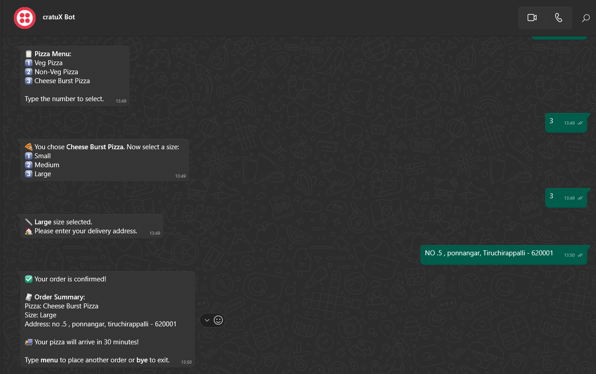

# 🍕 Pizza Planet WhatsApp Bot

A simple and interactive **WhatsApp bot built with Flask and Twilio** that lets users order pizza step by step.

---

## 🚀 Features

- Interactive pizza ordering via WhatsApp
- Choose pizza type, size, and enter delivery address
- Order confirmation with summary
- Commands: `menu` to start a new order, `bye` to exit
- Status check endpoint `/status`

---

## 📸 Screenshots

### 🟢 Conversation 1 – Starting the Bot and Selecting Pizza


---

### 🟢 Conversation 2 – Confirming the Order



> 📝 Save these images in a `screenshots/` folder in your project directory.

---

## 🛠️ Setup Instructions

### 1. Clone the Repository

```bash
git clone https://github.com/itsnicky35/Whatsapp-bot.git
cd pizza-planet-bot


